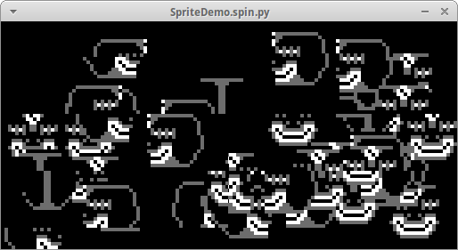

# LameMaker

LameMaker can turn LameStation games written in Spin into standalone
executables that can be run on a desktop computer. Because how cool is that!

Want to share your awesome game with your friends but they don't have a
LameStation? No problem! LameMake it!

*SpriteDemo.spin running on Ubuntu.*

## Installation

Set up the virtual environment.

    . virtualenv.sh

Install system dependencies.

    sudo apt-get install upx-ucl

Install python dependencies.

    pip install -r requirements.txt

## Usage

Here is a sample you can run right now.

    lamemaker -b -L lame -L media test/SpriteDemo.spin 

`SpriteDemo` will appear in the `dist/` directory. Run it like so:

    ./dist/SpriteDemo
